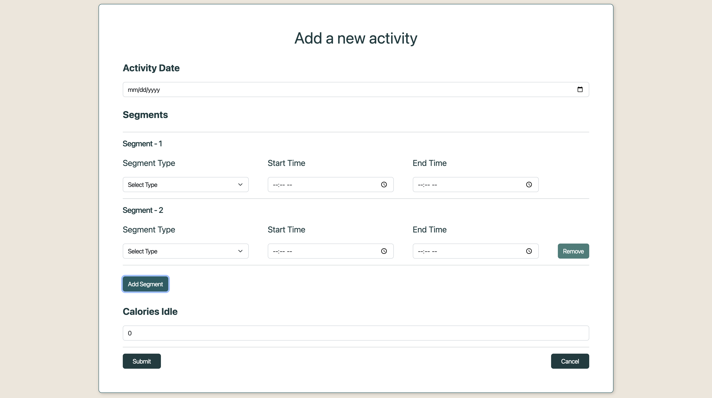
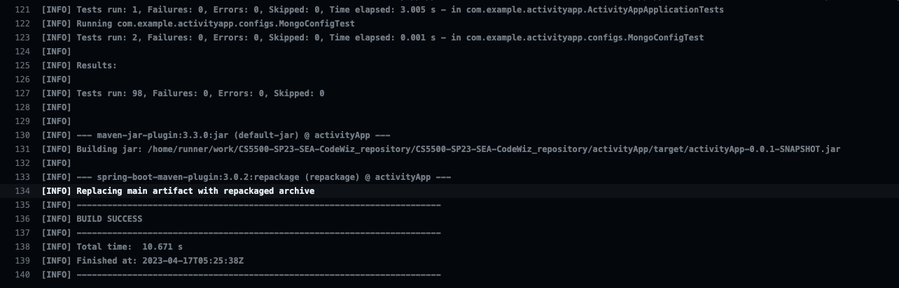

# Activity App

The Activity App is a Spring Boot application that allows users to create, view, and manage various types of activities.

## Table of Contents

- [Code Location](#Code-Location)
- [Installation](#installation)
- [Usage](#usage)
- [Endpoints](#Endpoints)
- [Configuration](#configuration)
- [Test Metrics](#Test-Metrics)
- [Known Problems](#Known-Problems)
- [Production](#Production)
- [Contributing](#contributing)

## Code-Location

1. the backend code for the Activity App is located in this github repo
2. the frontend code for the Activity App can found on this github repo https://github.com/khalid-bkr/Activity-app-reactTS


## Installation

1. Clone the repository
```bash
git clone https://github.com/your-username/your-project.git
```
2. Build the application
```bash
mvn clean install
```
3. Run the application
```bash
java -jar target/activityApp-0.0.1-SNAPSHOT.jar
```


## Usage


To use the Activity App, follow these steps:

navigate to the github repo containing the frontend for this application and clone it then run the server on port 3000.
https://github.com/khalid-bkr/Activity-app-reactTS


1. Open a web browser and navigate to `http://localhost:3000`.
2. Create a new activity if you desire by clicking the "Add Activity" button and filling out the form.
3. View your activities by filling the filter by required fields on the landing page/home page then clicking "search" button.
4. View more details about a specific activity by clicking on one of the search results from the previous step.
5. Ask questions about the number of estimated burned calories by navigating to the "Ask Ai Assistant" page and filling the filter with required fields then clicking the "submit" button.

## Endpoints

The Activity App provides the following endpoints:

- `POST /insertActivity` - Create a new activity
- `GET /allActivities` - Get all the activities
- `GET /byDate/{date}` - Get an activity by date with option to filter `type` if provided as a request param
- `GET /byDate/{date}/calories` - Get the total number of calories burned by an activity on a certain date with a feedback from our AI assistant  
- `GET /byDate/{start}/{end}` - Get a range of activities between to dates
- `GET /assistant` - Get a detailed feedback on a specific question by our AI assistant powered by OPENAI based on the number of calories burned.
- `DELETE /byDate/{date}` - Delete an activity by Date

## Configuration

The Activity App can be configured using environment variables. The following variables are available:

- `ACTIVITY_APP_MONGODB_URI` - The MongoDB connection URI to connect to your mongoDB database.
- `CHATGPT_API_KEY` - The API key from OpenAI to activate the AI assistant.

The ActivityAppWebMvcConfigurer class extends WebMvcConfigurer and provides configuration for Cross-Origin Resource Sharing (CORS) in the application.

```java
@Configuration
public class ActivityAppWebMvcConfigurer implements WebMvcConfigurer {
  @Override
  public void addCorsMappings(CorsRegistry registry) {
    registry.addMapping("/**")
        .allowedOrigins("http://localhost:3000")
        .allowedMethods("GET", "POST")
        .allowCredentials(true)
        .maxAge(3600);
  }
}
```
In the above code snippet, the addCorsMappings method is overridden to allow cross-origin requests from specified origins and HTTP methods. This configuration allows the http://localhost:3000 origins to make GET and POST requests to the application. If you want to limit access to specific origins, you can add or remove origins in the allowedOrigins method as needed. 

## Known-Problems
The following problems are currently known in the ActivityApp web application:

This is technically not a problem but the nature of data we have makes it hard to collect through normal forms as it is better to collect through a hardware tracking device and then to be sent to our servers.
However, due to the nature of this project we have created a simple form to collect the data partially to prove that our 'AddActivity' endpoint works correctly when used in our frontend, thus we have only implemented it in our development environment and have not pushed it to production.

below is an image for that page.



## Test-Metrics
- Test success rate: 100%
- Number of tests: 98 unit tests
- Test execution time: approximately 20 seconds




## Production

The Activity App is hosted using AWS Services and can be found hosted TEMPORARILY on https://www.activity-app.site/


## Contributing

If you would like to contribute to the project, please follow these guidelines:

1. Fork the project
2. Create a new branch (`git checkout -b feature`)
3. Make your changes and commit them (`git commit -am 'Add some feature'`)
4. Push to the branch (`git push origin feature`)
5. Create a new pull request
