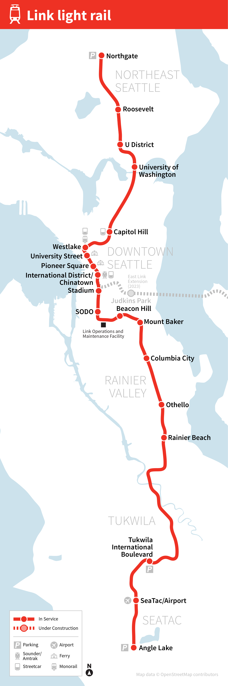
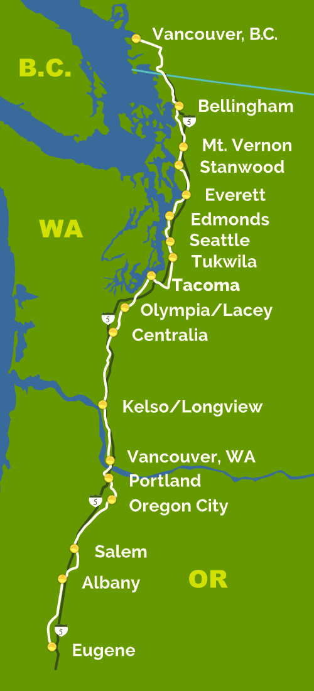

[](https://classroom.github.com/online_ide?assignment_repo_id=8941706&assignment_repo_type=AssignmentRepo)
# Trains 🚄🚅🚈🚝🚂

Topics: Prolog Intro

## Pre-req

The flavor of Prolog that we will be using is SWI-Prolog [https://www.swi-prolog.org/](https://www.swi-prolog.org/). Windows installs can be found [here](https://www.swi-prolog.org/download/stable) and instructions for installing on MacOS can be found [here](https://www.swi-prolog.org/build/macos.html) (homebrew is probably easier than macports). If you're having difficulty getting a local install, try the online version [https://swish.swi-prolog.org/](https://swish.swi-prolog.org/). To run SWI-Prolog use the command:

```bash
swipl
```

which will open the terminal. You can then use the command `consult(trains)` to run the [trains.pl](trains.pl) program as well as `reconsult(trains)` afterwards to quickly rebuild the knowledge base.

Alternatively you can use the command:

```bash
swipl trains.pl
```

to skip the `consult` command and just load in the program. Use commands like `link(northgate,X).` to see if a link has already been established.

## Instructions

For this assignment, you will become familiar with making declarations and try creating your own predicates. The first part is identifying what is true about the known universe. In our case, you will first define every train link from north to south for the Seattle Lightrail and the Amtrak Cascades. The first part has already been started for you:

```prolog
link(northgate,roosevelt).
link(roosevelt,udistrict).
link(udistrict,universityofwashington).
link(universityofwashington,capitolhill).
```

Photos of these routes are provided at the bottom of this README. Complete the rest of the links using the full name each station all in lowercase and without spacing nor special characters like `/`. A predicate called `south` has also been defined. You can try out `south(northgate,capitolhill).` and get back an answer of `true`. But if you tried `south(capitolhill,northgate).` you should get back `false`. You will need to complete the `north` predicate so that it will identify routes that go north. Lastly, complete the `connected(A,B)` predicate which is `true` when either a north route *or* south route exists, `false` otherwise.

A tester has been provided which you can run using the command:

```bash
swipl -g run_tests -t halt test_trains.pl
```

or you can load directly from within the prolog terminal using `consult(test_trains)` and `reconsult(test_trains)` as needed.

In summary:

1. Add the remaining links for both lines.
2. Create the `north` predicate.
3. Make a `connected` predicate.
4. Answer the reflection questions.

## Reflection

1. What is the importance of lowercase and uppercase letters in Prolog.
A text starting with a lowercase signals this is a "atom" while a text starting with a uppercase signals this is a variable. An atom in prolog is a single data point while a variable in prolog is a constant.


2. What are your thoughts on Prolog so far compared to an iterative programming language like Java or Python?
When it comes to declaring statements, prolog is easier. For example, if I have a list of nodes and I want to state that node 1 is connected to node 2, its easier to code mannually. However, I still prefer python and java over prolog because I am more comfortable with python and java. For me, if I use 1 language more than the other, I will naturall prefer what I am used to. If I spent more time with prolog, I probably would like it more.


3. In Prolog you cannot declare something as `false`. Why do you think this is the case? How does this relate to the "closed-world" assumption?
You cannot declare something as false because based on the "closed-world" assumption we must assume that atomic sentences not known to be true must be false. If we declare something as false, it is stating something in the closed-world is false when it may be true. 


4. What is the signifcance of Tukwila? What about Vancouver?
The signifcance of tukwila is that there are 2 different tukwilas. There is Tukwila Internation Boulevard (light rail) and Tukwila (amtrak). If we dont give these 2 different names when coding, it will cause issues. This is the same for Vancouver. In prolog and most programing languages its important to make each atom unique if we are assigning locations that are unique.


5. What happens if you link Angle Lake to Northgate? Is this what should happen?
No because Northgate is the first stop in the north while Angle lake is the last stop coming from the north. If you link both of Northgate and Angle Lake together, you will create a loop, which is not what we want. Also if we link angle lake and northgate, we can create a statement where northgate is south of angle lake, which is not true.


 
